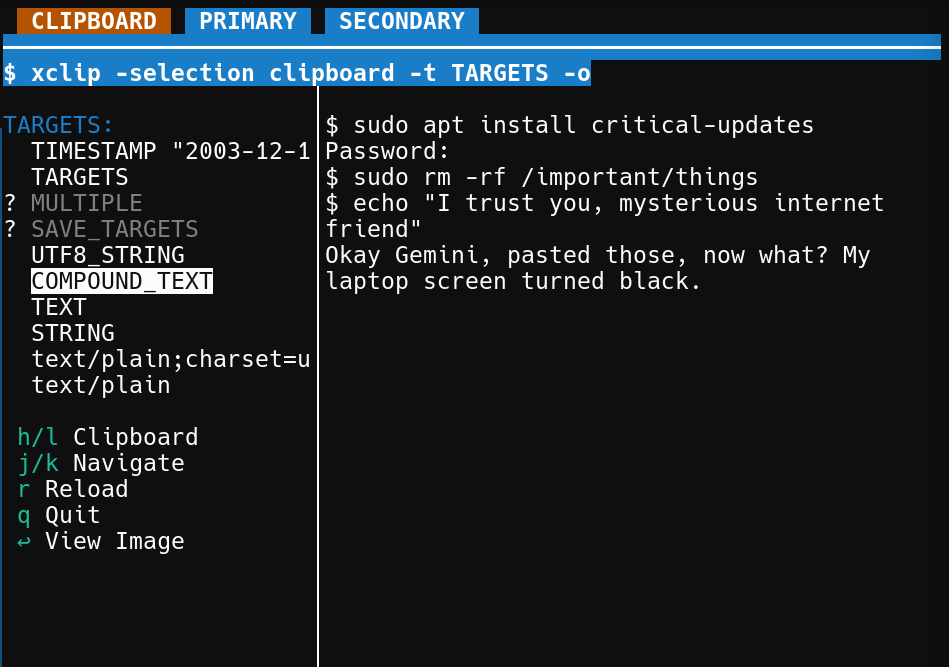

# clipboard-viewer

A terminal-based clipboard browser that treats your copy-paste buffer with the dignity it deserves. Because sometimes you need to know *exactly* what's lurking in there, and `xclip -o` just isn't ceremonious enough.

(Did it in pytnon for now.)

<div align="center">
  <em>Overview snapshot showing clipboard navigation and content preview</em><br>
  <br>
</div>

## What It Does

- Browse clipboard, primary, and secondary X11 selections
- Navigate available MIME targets (because yes, your clipboard has opinions about data formats)
- Preview text content
- View images directly in the terminal via [chafa](https://hpjansson.org/chafa/) (your ASCII art dreams, realized; although my chafa's defaulting to sixel or whatever atm)
- Vim-style navigation because some things are just correct

## Installation

```bash
# Dependencies
sudo apt install xclip imagemagick chafa  # Debian/Ubuntu
sudo pacman -S xclip imagemagick chafa    # Arch
brew install xclip imagemagick chafa      # macOS (via Homebrew)

# Then just download and run (or `chmod u+x` it first)
./xclipview
```

## Usage

| Key | Action |
|-----|--------|
| `h`/`l` or `←`/`→` | Switch between clipboard selections |
| `j`/`k` or `↑`/`↓` | Navigate target list |
| `Enter` | View images with chafa |
| `r` | Reload current selection |
| `q` | Quit |

The interface splits into a target list (left) and content preview (right). Targets with no data appear grayed out with a `?` prefix—they're the clipboard equivalent of "it's complicated."

<div align="center">
  <em>Image viewing mode with chafa integration</em><br>
  <br>
</div>

## Why This Exists

Standard clipboard tools show you *what* you copied. This shows you *how* your system thinks about what you copied. Sometimes that distinction matters. Sometimes you're just procrastinating. Either way, you're covered.

## Requirements

- Python 3.6+
- X11 environment (sorry, Wayland friends—patches welcome)
- A terminal that can handle basic Unicode (so, any terminal from this millennium)

## License

MIT. Copy freely, paste responsibly.
